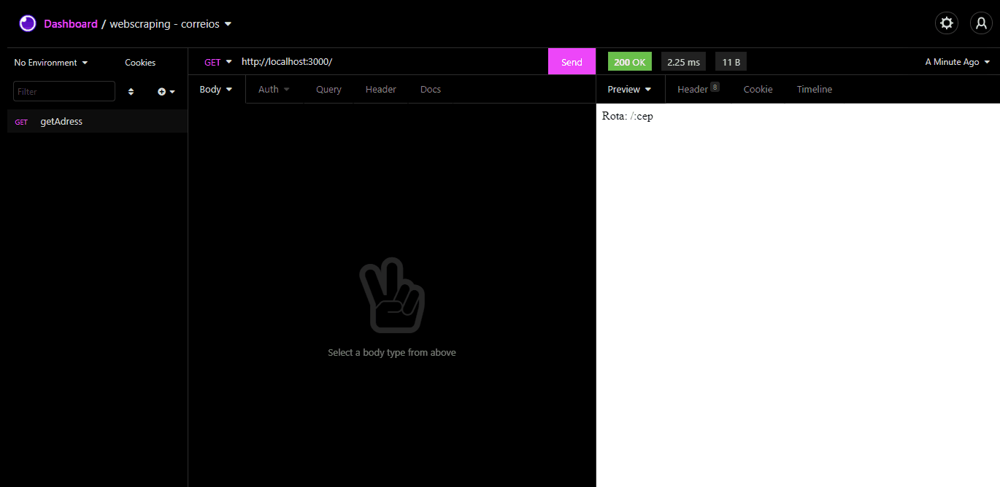

# Demo
 

    
  
  

    Web Scraping para consultar cep e encontrar endereço.
        
     
    <a href="https://github.com/devchallenge-io/biblioteca-backend">Desafio</a>
    <a href="https://www.devchallenge.com.br/">DevChallenge</a>
  

## Índice

* [Devchallenge](#devchallenge) 
* [Desafio](#desafio)
* [Techs](#techs)

# Desafio
Seu desafio é criar um web scraping para consultar um cep no site dos correios

# Techs: 
- <a href="https://nodejs.org/en/">Node.js<a>
- <a href="https://expressjs.com">Express.js<a>
- <a href="https://www.npmjs.com/package/nodemon">Nodemon<a>
- <a href="https://github.com/puppeteer/puppeteer">Puppeteer<a>

# DevChallenge
Site: https://www.devchallenge.com.br/  
Discord: https://discord.gg/yvYXhGj  
Linkedin: https://www.linkedin.com/company/devchallenge/ 
Twitter: https://twitter.com/dev_challenge 
Instagram: https://www.instagram.com/devchallenge/ 

Desafio criado por  <a href="https://github.com/filiafobico/">filiafobico</a> :)
